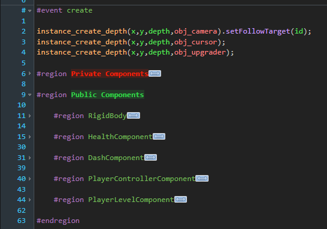

# Better Comments for GMEdit

Highlights important comment tags in GMEdit.




## Supported Tags

The default configuration includes:

- `TODO`
- `FIXME`
- `DANGER`
- `HACK`
- `NOTE`
- `WARN` / `WARNING`
- `QUESTION` / `ASK`
- leading `!`
- leading `?`

`!` and `?` use `leadingOnly`, so they only match when placed immediately after the comment prefix and optional whitespace:

```gml
// ! Important warning
// ? Open question
```

They do not match punctuation later in a regular comment:

```gml
// Is this normal text?
```

## Regions

You can also color `#region` labels by the first word after `#region`.

```json
{
  "name": "Components",
  "color": "#98C379"
}
```

Place entries in `betterComments.regions`:

```json
"regions": [
  { "name": "Components", "color": "#98C379" }
]
```

This colors region labels that start with `Components`:

```gml
#region Components
#region Components UI
```

It does not color regions where `Components` is not the first word:

```gml
#region UI Components
```

Inline colors are also supported:

```gml
#region[#98C379] Components
#region [#F80] Fast path
```

Only the region label is recolored. `#region`, `[hex]`, and `#endregion` keep their normal GMEdit styling.

## Global configuration

Edit `config.json` and update `betterComments.tags`.

```json
{
  "name": "todo",
  "match": "TODO\\b:?",
  "color": "#4DA3FF"
}
```

Fields:

- `name`: logical tag name. Entries with the same name share one generated CSS class.
- `match`: regex fragment used by Ace tokenizer rules.
- `color`: hex color, either `#RGB` or `#RRGGBB`.
- `leadingOnly`: optional boolean. Use it for short symbol tags like `?` and `!`.

Example:

```json
{
  "name": "optimize",
  "match": "OPTIMIZE\\b:?",
  "color": "#98C379"
}
```

After changing `config.json`, restart GMEdit.

## Project Configuration

Project-specific settings can be placed in:

```text
<project>/.gmedit/better-comments.json
```

The project file uses the same inner structure as `betterComments`:

```json
{
  "tags": [{ "name": "todo", "match": "TODO\\b:?", "color": "#FFFFFF" }],
  "regions": [{ "name": "Private", "color": "#FF0000" }]
}
```

Project entries are merged with the plugin config. A project tag with the same `name` replaces all global tag entries with that name. A project region with the same first word replaces the global region entry for that word.
