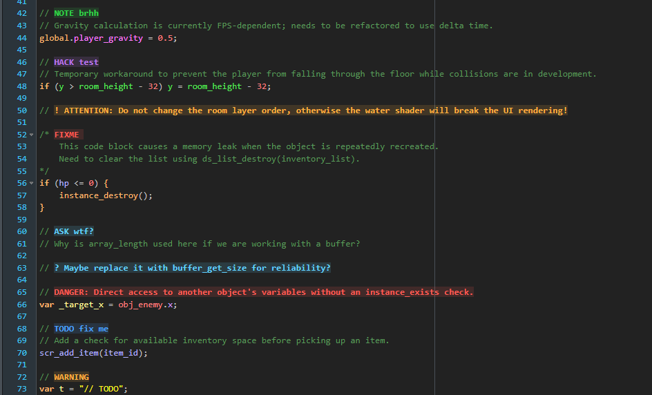

# Better Comments for GMEdit

Highlights important comment tags in GMEdit.



## Supported Tags

The default configuration includes:

- `TODO`
- `FIXME`
- `DANGER`
- `HACK`
- `NOTE`
- `WARN` / `WARNING`
- `QUESTION` / `ASK`
- leading `!`
- leading `?`

`!` and `?` use `leadingOnly`, so they only match when placed immediately after the comment prefix and optional whitespace:

```gml
// ! Important warning
// ? Open question
```

They do not match punctuation later in a regular comment:

```gml
// Is this normal text?
```

## Configuration

Edit `config.json` and update `betterComments.tags`.

```json
{
  "name": "todo",
  "match": "TODO\\b:?",
  "color": "#4DA3FF"
}
```

Fields:

- `name`: logical tag name. Entries with the same name share one generated CSS class.
- `match`: regex fragment used by Ace tokenizer rules.
- `color`: hex color, either `#RGB` or `#RRGGBB`.
- `leadingOnly`: optional boolean. Use it for short symbol tags like `?` and `!`.

Example:

```json
{
  "name": "optimize",
  "match": "OPTIMIZE\\b:?",
  "color": "#98C379"
}
```

After changing `config.json`, reload the plugin or restart GMEdit.
